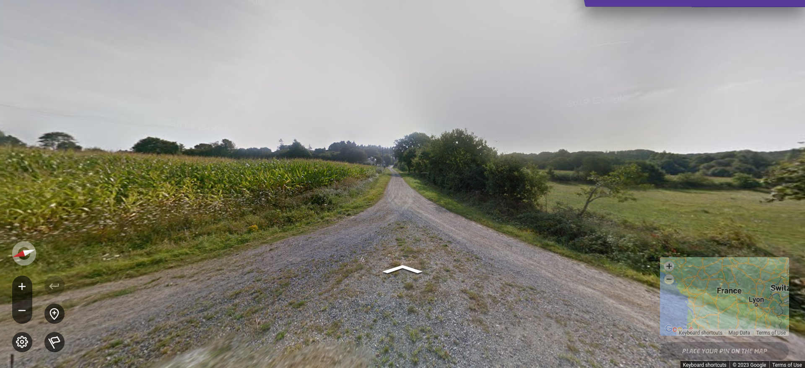

# FrancoDetect
FrancoDetect is a model that aims to guess the location in France based off an image. The project was inspired by the popular game [geoguessr](geoguessr.com), where you are placed at a random site in Google Street View mode and have to pin your location on a map. Our model is divided into three steps (see below), some of which use the [StreetCLIP model](https://huggingface.co/geolocal/StreetCLIP), which in turn is based off OpenAI's [CLIP model](https://openai.com/research/clip). By combining these pretrained models with a variety of self-trained models (using Python's [scikit-learn](scikit-learn.org) library), we were able to reach a median distance error of 75km and a mean distance error of 115km.

## Overview

## Usage

To use our model, simply clone this repository and install the necessary requirements found [here](requirements.txt). You can then load the images you want to have located into the [test pictures](test_pictures) folder and run the [Jupyter Notebook](Test%20Model.ipynb) (or you can of course use the pictures that are already in the folder by default). If you want to test the model in a real geoguessr game you can use the [web application](web_interface/Web%20Application.py) script as a template. It should be noted however that to do so you will need to taylor the parameters used in the script to your device's and your browser's specifications.

## Example usage
We are playing a round of geoguessr with our AI using the [web application](Web%20Application.py) script (note: I did not pick an exceptionally good round). To do so, we start a game in our browser and then run the Python script. A geoguessr game consists of five locations, in each of which we first make a screenshot of the following form:

The script then applies our model according to the Flow Chart above and delivers as a result an arrondissement or a city in France. We then convert this result into coordinates (latitude, longitude) and place the guess on the map. After all five rounds have been completed we can analyze our results:

In this case, we got three locations almost exactly right and were quite far off in the other two.
